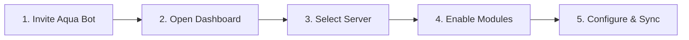

<div align="center">

# 💧 Aqua Bot

**The all-in-one Discord bot with a modern web dashboard.**

Moderation, automod, tickets, giveaways, leveling, stream alerts, auto-translate, and **25+ modules** — all controlled from one beautiful dashboard.

<br />

[](https://github.com/heema2/Aqua-Bot)
[](https://discord.com/oauth2/authorize?client_id=1512880652461150289&permissions=1099914800214&scope=bot%20applications.commands)
[](https://www.aqua-bot.xyz/login)
[](https://nodejs.org/)
[](https://discord.js.org/)

<br />

[**➕ Invite Bot**](https://discord.com/oauth2/authorize?client_id=1512880652461150289&permissions=1099914800214&scope=bot%20applications.commands)
&nbsp;•&nbsp;
[**🛠️ Dashboard**](https://www.aqua-bot.xyz/login)
&nbsp;•&nbsp;
[**🌐 Website**](https://www.aqua-bot.xyz)
&nbsp;•&nbsp;
[**💬 Support**](https://discord.gg/kKaSX5QJwa)

</div>

---

> **📌 Repository notice**  
> This repository is a **public information hub** — links, overview, changelog, and resources. Aqua Bot **source code is not open source**.

---

## 📑 Table of contents

- [What is Aqua Bot?](#-what-is-aqua-bot)
- [Quick links](#-quick-links)
- [Features](#-features)
- [Web dashboard](#-web-dashboard)
- [Getting started](#-getting-started)
- [What's new](#-whats-new)
- [Permissions](#-permissions)
- [Tech stack](#-tech-stack)
- [Support & contact](#-support--contact)
- [Legal](#-legal)

---

## ✨ What is Aqua Bot?

Aqua Bot is a **production-ready Discord management bot** built for server admins who want powerful features without juggling multiple bots.

Configure everything from a **clean, modern web dashboard** — enable modules, set permissions, build welcome messages, tickets, giveaways, and automod rules without digging through slash commands.

| | |
|---|---|
| 🧩 **25+ modules** | Moderation, engagement, automation, and utility |
| 🖥️ **Full dashboard** | Per-server control in your browser |
| ⚡ **Slash commands** | Modern Discord UX, per-guild command menus |
| 🔐 **Minimal permissions** | No Administrator required |
| 🌍 **Multi-language** | Dashboard locales + auto-translate for communities |

---

## 🔗 Quick links

| Resource | URL |
|----------|-----|
| ➕ **Invite the bot** | https://discord.com/oauth2/authorize?client_id=1512880652461150289&permissions=1099914800214&scope=bot%20applications.commands |
| 🛠️ **Web dashboard** | https://www.aqua-bot.xyz/login |
| 🌐 **Website** | https://www.aqua-bot.xyz |
| 📜 **Commands** | https://www.aqua-bot.xyz/commands |
| 📊 **Status** | https://www.aqua-bot.xyz/status |
| 🏠 **Listed servers** | https://www.aqua-bot.xyz/servers |
| 💬 **Support server** | https://discord.gg/kKaSX5QJwa |
| ✉️ **Contact** | aqua-bot@outlook.com |
| 🔒 **Privacy** | https://www.aqua-bot.xyz/privacy |
| 📋 **Terms** | https://www.aqua-bot.xyz/terms |

---

## 🚀 Features

### 🛡️ Moderation & safety

| Feature | Description |
|---------|-------------|
| **Moderation suite** | Ban, kick, timeout, warn, mute, purge, lockdown |
| **Mod cases** | Full audit trails and mod statistics |
| **Automod** | Anti-spam, anti-invite, scam detection, profanity filters |
| **Autoban** | Account-age and username rules on join |
| **Protected roles** | Prevent moderation against selected roles |

### 🎫 Community & support

| Feature | Description |
|---------|-------------|
| **Tickets** | Panels, claim/close, transcripts, AFK restore |
| **Suggestions** | Voting, filters, and optional DMs |
| **Server logging** | Messages, members, roles, voice, moderation events |
| **Server listing** | Public server directory with admin curation |

### 🎉 Engagement

| Feature | Description |
|---------|-------------|
| **Giveaways** | Role gates, bonus entries, server tag requirement, participants list, weighted draws |
| **Leveling & XP** | Leaderboards and role rewards |
| **Reaction roles** | Buttons, selects, and classic reactions |
| **Starboard** | Highlight top community messages |
| **Invite tracker** | Stats and leaderboards |
| **Booster thanks** | Celebrate new server boosters |
| **Stream alerts** | YouTube, Twitch, Kick, TikTok notifications |

### ⚙️ Automation & utility

| Feature | Description |
|---------|-------------|
| **Welcome & announcements** | Text or rich embed builders |
| **Custom commands** | Server-defined responses with variables |
| **Scheduled messages** | Repeating channel announcements |
| **Auto translate** | Multilingual embeds with translation buttons |
| **Auto-delete & image-only** | Channel hygiene rules |
| **Auto reaction** | Keyword reactions and announcement packs |
| **Tags, polls, reminders, AFK** | Everyday server utilities |
| **Bug reports** | Report issues from the dashboard or `/report-bug` in Discord |

---

## 🖥️ Web dashboard

The Aqua Bot dashboard gives server admins a **clean, dark-themed interface** to manage everything in one place.

```
┌─────────────────────────────────────────────────────────────┐
│  Dashboard  │  Per-server sidebar  │  Module pages         │
├─────────────────────────────────────────────────────────────┤
│  • Module toggles & command permissions                   │
│  • Visual message builders (welcome, tickets, alerts)     │
│  • Automod rules with multi-action support                  │
│  • Moderation, logging, giveaways, starboard config       │
│  • Sync Required banner — keeps slash commands up to date   │
│  • Setup wizard & onboarding checklist                      │
└─────────────────────────────────────────────────────────────┘
```

---

## 🏁 Getting started



1. **[Invite Aqua Bot](https://discord.com/oauth2/authorize?client_id=1512880652461150289&permissions=1099914800214&scope=bot%20applications.commands)** to your server.
2. **[Open the dashboard](https://www.aqua-bot.xyz/login)** and sign in with Discord.
3. **Select your server** and enable the modules you need.
4. **Configure** automod, welcome, tickets, leveling, and more.
5. If prompted, click **Sync** to register slash commands with Discord.
6. **[Join the support server](https://discord.gg/kKaSX5QJwa)** if you need help.

---

## 🆕 What's new

<details open>
<summary><strong>Latest — v1.2.45</strong></summary>

<br />

- **Giveaways** — Giveaway Boat–style embeds, required/blacklist roles, bonus entries per role, server tag requirement, and a **Participants** button with paginated list
- **Announcements** dashboard lists paginate at 10 per page; remove from list without deleting in Discord (v1.2.43–44)

See the full history in [**CHANGELOG.md**](./CHANGELOG.md).

</details>

---

## 🔐 Permissions

The invite link requests only what Aqua Bot needs to function:

- Manage messages, roles, channels, and moderation actions
- Send embeds and use slash commands
- Read message history and attach files

**Administrator is not required.** Permissions are transparent and documented on the [website](https://www.aqua-bot.xyz).

---

## 🛠️ Tech stack

| Layer | Technology |
|-------|------------|
| **Bot** | Node.js 20+, Discord.js v14, slash commands |
| **Dashboard** | Next.js 14, React 18, Tailwind CSS |
| **API** | Node.js REST API with Discord OAuth2 |
| **Commands** | Discord slash commands |

*This repo does not include source code — it is a public information hub.*

---

## 💬 Support & contact

| Channel | Link |
|---------|------|
| 💬 **Discord support** | [Aqua's Support Server](https://discord.gg/kKaSX5QJwa) |
| ✉️ **Email** | aqua-bot@outlook.com |
| 👤 **Operator** | Ryuk Developments |

For bugs, feature requests, or setup help, please use the **support server**.

---

## ⚖️ Legal

- [Privacy Policy](https://www.aqua-bot.xyz/privacy)
- [Terms of Use](https://www.aqua-bot.xyz/terms)

Aqua Bot is **not affiliated** with Discord Inc.

---

<div align="center">

<br />

**Built with ❤️ by [Ryuk Developments](https://www.aqua-bot.xyz)**

<br />

[](https://www.aqua-bot.xyz)
[](https://discord.gg/kKaSX5QJwa)
[](mailto:aqua-bot@outlook.com)

</div>
